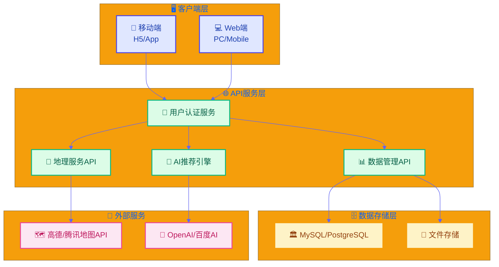
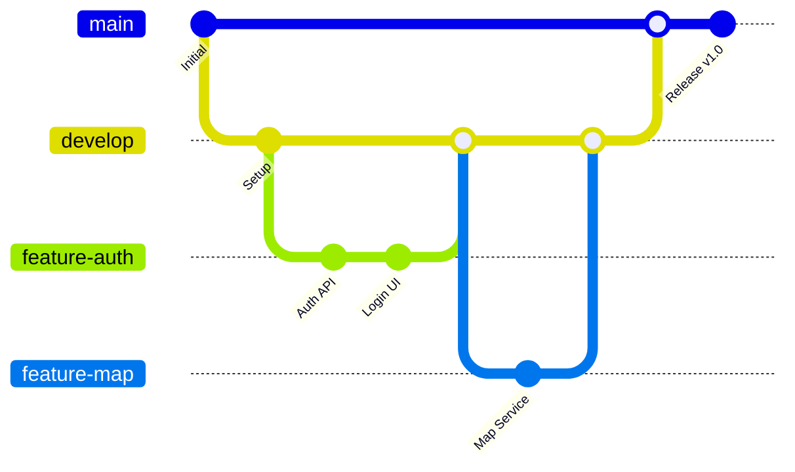
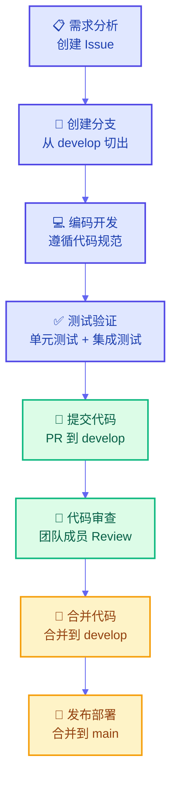
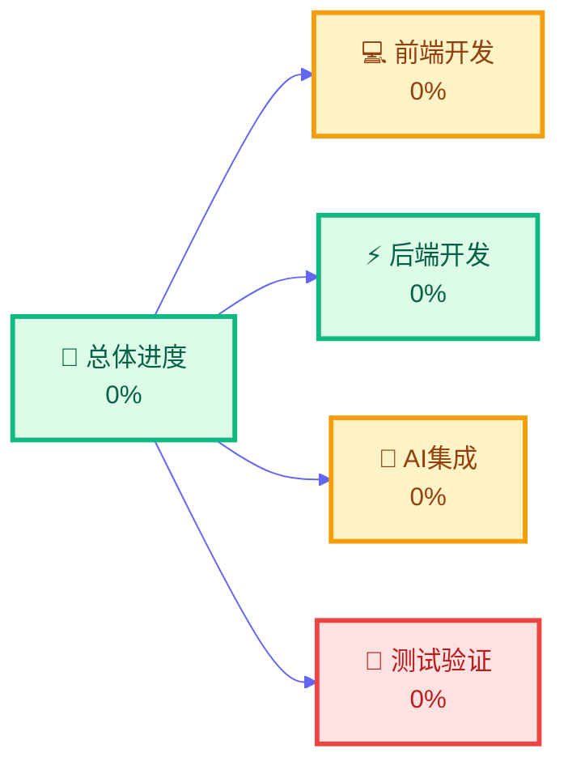

# 🌟 TravelSmart - AI驱动的智能旅游推荐系统

<div align="center">


[](https://claude.ai/chat/LICENSE) [](https://github.com/your-username/TravelSmart) [](https://github.com/your-username/TravelSmart/releases) [](https://github.com/your-username/TravelSmart/stargazers)

*一个融合AI智能推荐与地图服务的现代化旅游平台*

[🚀 快速开始](https://claude.ai/chat/5b683638-41ff-42be-a2cd-2ea2dc38898f#-快速开始) • [📖 文档](https://claude.ai/chat/5b683638-41ff-42be-a2cd-2ea2dc38898f#-项目文档) • [🛠️ 开发指南](https://claude.ai/chat/5b683638-41ff-42be-a2cd-2ea2dc38898f#️-开发指南) • [🤝 贡献指南](https://claude.ai/chat/5b683638-41ff-42be-a2cd-2ea2dc38898f#-贡献指南)

------

## 📋 目录

- [✨ 项目特色](https://claude.ai/chat/5b683638-41ff-42be-a2cd-2ea2dc38898f#-项目特色)
- [🏗️ 系统架构](https://claude.ai/chat/5b683638-41ff-42be-a2cd-2ea2dc38898f#️-系统架构)
- [💻 技术栈](https://claude.ai/chat/5b683638-41ff-42be-a2cd-2ea2dc38898f#-技术栈)
- [📊 数据库设计](https://claude.ai/chat/5b683638-41ff-42be-a2cd-2ea2dc38898f#-数据库设计)
- [🚀 快速开始](https://claude.ai/chat/5b683638-41ff-42be-a2cd-2ea2dc38898f#-快速开始)
- [🛠️ 开发指南](https://claude.ai/chat/5b683638-41ff-42be-a2cd-2ea2dc38898f#️-开发指南)
- [📖 项目文档](https://claude.ai/chat/5b683638-41ff-42be-a2cd-2ea2dc38898f#-项目文档)
- [🔄 开发流程](https://claude.ai/chat/5b683638-41ff-42be-a2cd-2ea2dc38898f#-开发流程)
- [🤝 贡献指南](https://claude.ai/chat/5b683638-41ff-42be-a2cd-2ea2dc38898f#-贡献指南)
- [📄 许可证](https://claude.ai/chat/5b683638-41ff-42be-a2cd-2ea2dc38898f#-许可证)

------

## ✨ 项目特色

<table> <tr> <td width="50%">

### 🤖 AI智能推荐

- 基于用户偏好的个性化路线推荐
- 智能美食与景点匹配
- 自然语言问答助手
- 实时路径优化建议

### 🗺️ 地图服务集成

- 高德/腾讯地图深度集成
- 实时地理定位与导航
- POI搜索与周边发现
- 可视化路线规划

### 📱 跨平台支持

- 响应式Web界面设计
- 移动端H5适配
- 统一API接口设计
- 一致的用户体验

### 🔒 用户体系

- 多种登录方式支持
- 个人偏好管理
- 游记评论系统
- 社交分享功能

------

## 🏗️ 系统架构



------

## 💻 技术栈

### 前端技术

<div align="center">

   


### 后端技术

<div align="center">

   


### 数据库与存储

<div align="center">

  


------

## 📊 数据库设计

### 🏛️ 核心表结构

<details> <summary><b>🎯 景点表 (Spots)</b></summary></details>

| 字段名            | 类型          | 说明        | 索引    |
| ----------------- | ------------- | ----------- | ------- |
| `id`              | INT           | 主键，自增  | PRIMARY |
| `name`            | VARCHAR(255)  | 景点名称    | INDEX   |
| `description`     | TEXT          | 详细描述    | -       |
| `address`         | VARCHAR(500)  | 详细地址    | -       |
| `longitude`       | DECIMAL(10,6) | 经度坐标    | INDEX   |
| `latitude`        | DECIMAL(10,6) | 纬度坐标    | INDEX   |
| `type`            | VARCHAR(50)   | 景点类型    | INDEX   |
| `images`          | JSON          | 图片URL数组 | -       |
| `city`            | VARCHAR(100)  | 所在城市    | INDEX   |
| `recommend_level` | INT           | AI推荐等级  | INDEX   |

 <details> <summary><b>🍽️ 美食表 (Foods)</b></summary></details>

| 字段名        | 类型          | 说明       | 索引    |
| ------------- | ------------- | ---------- | ------- |
| `id`          | INT           | 主键，自增 | PRIMARY |
| `name`        | VARCHAR(255)  | 美食名称   | INDEX   |
| `description` | TEXT          | 特色描述   | -       |
| `address`     | VARCHAR(500)  | 店铺地址   | -       |
| `longitude`   | DECIMAL(10,6) | 经度坐标   | INDEX   |
| `latitude`    | DECIMAL(10,6) | 纬度坐标   | INDEX   |
| `type`        | VARCHAR(50)   | 美食类型   | INDEX   |
| `images`      | JSON          | 美食图片   | -       |
| `city`        | VARCHAR(100)  | 所在城市   | INDEX   |

<details> <summary><b>🛣️ 路线表 (Routes)</b></summary></details>

| 字段名          | 类型         | 说明           | 索引        |
| --------------- | ------------ | -------------- | ----------- |
| `id`            | INT          | 主键，自增     | PRIMARY     |
| `name`          | VARCHAR(255) | 路线名称       | INDEX       |
| `description`   | TEXT         | 路线描述       | -           |
| `start_spot_id` | INT          | 起点景点ID     | FOREIGN KEY |
| `end_spot_id`   | INT          | 终点景点ID     | FOREIGN KEY |
| `waypoints`     | JSON         | 途经点数组     | -           |
| `distance`      | FLOAT        | 总距离(km)     | -           |
| `duration`      | INT          | 预计时长(分钟) | -           |
| `route_type`    | VARCHAR(20)  | 路线类型       | INDEX       |


------

## 🚀 快速开始

### 📋 环境要求

- **Node.js** >= 16.0.0
- **Python** >= 3.8
- **MySQL** >= 8.0 或 **PostgreSQL** >= 12
- **Redis** >= 6.0 (可选，用于缓存)

### 🛠️ 安装步骤（示例）

1. **克隆项目**

   ```bash
   git clone https://github.com/your-username/TravelSmart.git
   cd TravelSmart
   ```

2. **安装后端依赖**

   ```bash
   cd backend
   pip install -r requirements.txt
   ```

3. **安装前端依赖**

   ```bash
   cd ../frontend
   npm install
   ```

4. **配置环境变量**

   ```bash
   cp .env.example .env
   # 编辑 .env 文件，配置数据库和API密钥
   ```

5. **初始化数据库**

   ```bash
   cd backend
   python manage.py migrate
   python manage.py seed  # 导入示例数据
   ```

6. **启动服务**

   ```bash
   # 启动后端服务
   cd backend && python main.py
   
   # 启动前端开发服务器
   cd frontend && npm run dev
   ```

### 🌐 访问应用（示例）

- 🖥️ **前端界面**: http://localhost:3000
- 🔌 **API文档**: http://localhost:8000/docs
- 📊 **管理后台**: http://localhost:8000/admin

------

## 🛠️ 开发指南

### 📁 项目结构

```
TravelSmart/
├── 📁 frontend/                 # 前端代码
│   ├── 📁 src/
│   │   ├── 📁 components/       # 可复用组件
│   │   ├── 📁 pages/           # 页面组件
│   │   ├── 📁 hooks/           # 自定义Hooks
│   │   ├── 📁 utils/           # 工具函数
│   │   └── 📁 styles/          # 样式文件
│   ├── 📄 package.json
│   └── 📄 vite.config.js
├── 📁 backend/                  # 后端代码
│   ├── 📁 app/
│   │   ├── 📁 api/             # API路由
│   │   ├── 📁 models/          # 数据模型
│   │   ├── 📁 services/        # 业务逻辑
│   │   └── 📁 utils/           # 工具函数
│   ├── 📁 migrations/          # 数据库迁移
│   ├── 📄 requirements.txt
│   └── 📄 main.py
├── 📁 docs/                     # 项目文档
├── 📁 scripts/                  # 部署脚本
├── 📄 docker-compose.yml       # Docker编排
├── 📄 README.md
└── 📄 LICENSE
```

### 🎨 代码规范

- **前端**: 使用 ESLint + Prettier
- **后端**: 使用 Black + Flake8
- **提交**: 遵循 [Conventional Commits](https://conventionalcommits.org/) 规范

------

## 🔄 开发流程

### 🌿 分支策略



### 📝 分支命名规范

| 分支类型   | 命名格式          | 示例                        | 说明         |
| ---------- | ----------------- | --------------------------- | ------------ |
| 🚀 功能开发 | `feature/功能名`  | `feature/ai-recommendation` | 新功能开发   |
| 🐛 Bug修复  | `bugfix/问题描述` | `bugfix/login-error`        | 修复线上问题 |
| 🔥 热修复   | `hotfix/紧急修复` | `hotfix/security-patch`     | 紧急线上修复 |
| 📚 文档更新 | `docs/文档类型`   | `docs/api-documentation`    | 文档相关更新 |

### 🔄 工作流程



------

## 📖 项目文档

### 📚 详细文档

- [🏗️ 架构设计文档](https://claude.ai/chat/docs/architecture.md)
- [🔌 API接口文档](https://claude.ai/chat/docs/api.md)
- [🗄️ 数据库设计文档](https://claude.ai/chat/docs/database.md)
- [🚀 部署运维文档](https://claude.ai/chat/docs/deployment.md)
- [🧪 测试指南](https://claude.ai/chat/docs/testing.md)

### 🎯 开发规范

- [📝 编码规范](https://claude.ai/chat/docs/coding-standards.md)
- [🌿 Git工作流](https://claude.ai/chat/docs/git-workflow.md)
- [🔍 代码审查指南](https://claude.ai/chat/docs/code-review.md)

------

## 🤝 贡献指南

我们欢迎所有形式的贡献！请查看 [贡献指南](https://claude.ai/chat/CONTRIBUTING.md) 了解详细信息。

### 👥 贡献者

<a href="https://github.com/your-username/TravelSmart/graphs/contributors">    </a>

### 🙏 致谢

感谢以下开源项目和服务商：

- [⚛️ React](https://reactjs.org/) - 前端框架
- [🐍 FastAPI](https://fastapi.tiangolo.com/) - 后端框架
- [🗺️ 高德地图](https://lbs.amap.com/) - 地图服务
- [🤖 OpenAI](https://openai.com/) - AI服务

------

## 📊 项目状态

### 🎯 当前版本: v1.0.0

- ✅ 用户认证系统 (开发中)
- ✅ 景点美食管理 (开发中)
- ✅ 地图服务集成 (开发中)
- 🚧 AI推荐引擎 (开发中)
- 📋 移动端适配 (计划中)

### 📈 开发进度

<div align="center">



**进度条可视化**

    


------

## 📄 许可证

本项目采用 [MIT License](https://claude.ai/chat/LICENSE) 开源协议。

------

<div align="center">

**🌟 如果这个项目对你有帮助，请给我们一个Star！**

[⭐ Star](https://github.com/your-username/TravelSmart) | [🐛 Report Bug](https://github.com/your-username/TravelSmart/issues) | [💡 Request Feature](https://github.com/your-username/TravelSmart/issues)

------

*Made with ❤️ by TravelSmart Team*

## 🔗 相关链接

- 📖 [项目官网](https://travelsmart.example.com/)
- 📧 [联系我们](mailto:team@travelsmart.com)
- 💬 [Discord社区](https://discord.gg/travelsmart)
- 🐦 [Twitter](https://twitter.com/TravelSmartApp)
